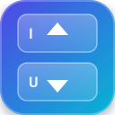

<p align="center">
  
</p>

<h1 align="center">Scrollith</h1>

<p align="center">
  <strong>Tactile Keyboard Scroller & Instant Tab Switcher for Desktop Browsers</strong>
</p>

<p align="center">
  
  
  
  
</p>

---

> 🦊 **Officially available on Mozilla Firefox Add-ons for Desktop!**
> Install Scrollith directly from the Firefox Add-ons store for desktop, or load it unpacked into any Chromium browser (Google Chrome, Brave, Edge, Opera, Vivaldi).

---

## 📖 Overview

Scrollith lets you glide through web pages using **`H`** (scroll down) and **`G`** (scroll up) with a custom kinetic physics engine calibrated for buttery-smooth momentum.

When typing inside text boxes, code editors, or form inputs, Scrollith protects your typing from hijacking: use **`Alt + H`** and **`Alt + G`** to scroll smoothly without clicking away or losing focus. It also features global tab switching via **`Alt + U`** (left tab) and **`Alt + I`** (right tab), plus a dedicated full-screen options dashboard and a minimal toolbar popup.

---

## ⚡ Keyboard Shortcuts

| Shortcut | Action | Description |
| :--- | :--- | :--- |
| **`H`** | **Scroll Down** | Glides down current page or hovered panel with kinetic momentum. |
| **`G`** | **Scroll Up** | Glides up current page or hovered panel with kinetic momentum. |
| **`Alt + H`** | **Scroll Down (Inputs & Global)** | Scrolls down smoothly even while actively focused inside inputs or editors. |
| **`Alt + G`** | **Scroll Up (Inputs & Global)** | Scrolls up smoothly even while actively focused inside inputs or editors. |
| **`Alt + U`** | **Previous Tab (Left)** | Instantly cycles to the browser tab on the left. |
| **`Alt + I`** | **Next Tab (Right)** | Instantly cycles to the browser tab on the right. |
| **`Shift + H`** | **Turbo Scroll Down** | 2.5× accelerated downward scroll. |
| **`Shift + G`** | **Turbo Scroll Up** | 2.5× accelerated upward scroll. |

---

## ✨ Features

- **🌊 Kinetic Physics Engine**: Built on `requestAnimationFrame` with sub-pixel accumulator and natural friction decay. Matches your monitor's native refresh rate (60Hz, 120Hz, 144Hz+) for stutter-free fluid motion.
- **🛡️ Smart Typing Safety & Input-Mode Scrolling**: Single keys (`H` and `G`) are never intercepted while you type in:
  - `<input>`, `<textarea>`, `<select>`
  - `[contenteditable]` elements (Notion, Google Docs, Medium, Obsidian web)
  - Web code editors (Monaco / VS Code web, CodeMirror, ACE)
  - **In typing fields**: Simply press **`Alt + H`** or **`Alt + G`** to scroll without losing cursor position!
- **🌐 Global Tab Navigation**: `Alt + U` and `Alt + I` switch tabs seamlessly across your browser window with automatic edge wrapping.
- **🖥️ Full-Screen Options Dashboard**:
  - Spacious Gruvbox dark workbench interface (`chrome://` or `moz-extension://` options page).
  - Tactile 3D mechanical keycaps with realistic press animations and click-to-rebind modal.
  - Interactive test pad with live input typing test and instant shortcut safeguard indicators.
  - Excluded sites manager (blacklist specific domains).
- **🎛️ Minimal Quick-Control Popup**:
  - Compact popup window with master power toggle, current domain exclusion button, and scroll speed slider.
  - Dedicated **Settings Gear Icon (⚙)** and **"More Settings"** button that opens the full dashboard tab in one click.
- **🛠️ Developer Options & Curated Key Selector**:
  - Curated, conflict-checked single-key list categorized by safety rating (Safe, Minor Conflict, High Conflict).
  - Quick presets: **Default (G/H)**, **Classic (I/U)**, **Vim (K/J)**, **Brackets ([/])**, and **Bottom (M/N)**.
  - Real-time conflict analysis prevents collisions with web shortcuts (YouTube, Reddit, Vimium, GitHub).
- **🎯 Smart Hover Targeting**: Hovering your mouse over an overflow container (sidebar, code block, chat window) scrolls that specific element instead of the background page.
- **🔒 100% Private & Offline**: Zero analytics, zero tracking, zero external network requests. All settings are stored locally via `browser.storage`.

---

## 📦 Installation & Getting Started

### Official Firefox Add-on (Desktop)
1. Visit the **Firefox Add-ons (AMO)** store and search for **Scrollith**.
2. Click **"Add to Firefox"**.
3. Pin Scrollith to your toolbar for quick access!

---

### Manual Installation (Development / Local)

#### For Firefox Browsers (Mozilla Firefox, LibreWolf, Floorp, Waterfox)
1. Open Firefox and go to:
   ```text
   about:debugging#/runtime/this-firefox
   ```
2. Click **"Load Temporary Add-on..."**.
3. Select `manifest.json` inside the repository folder.

#### For Chromium Browsers (Google Chrome, Brave, Microsoft Edge, Opera, Vivaldi)
1. Open your browser and navigate to:
   - **Chrome**: `chrome://extensions`
   - **Brave**: `brave://extensions`
   - **Edge**: `edge://extensions`
2. Enable **Developer mode** (top-right toggle).
3. Click **"Load unpacked"** and select the extension directory.
4. Pin Scrollith to your browser toolbar.

---

## 🎛️ Settings & Dashboard

* **Toolbar Popup**: Click the extension icon in your toolbar for instant controls (Master On/Off, exclude current site, and quick distance slider).
* **Full-Page Dashboard**: Click the **⚙ gear icon** in the popup or right-click the extension icon → **Options** to launch the full-screen options dashboard with the keybinding manager, scroll tuning, and interactive test pad.

---

## 📁 Repository Structure

```text
keyboard_scroller_extension/
├── manifest.json              # Dual Manifest V3 config (Chromium & Firefox)
├── background/
│   └── background.js          # Service worker for tab switching commands
├── content/
│   ├── content.js             # Kinetic physics scroll engine & safe typing guard
│   └── content.css            # Optional on-screen HUD styling
├── popup/
│   ├── popup.html             # Minimal toolbar popup interface
│   ├── popup.css              # Gruvbox dark tactile styles
│   └── popup.js               # Quick controls & full dashboard launcher
├── options/
│   ├── options.html           # Full-screen options dashboard
│   ├── options.css            # Gruvbox workbench theme & 3D keycaps
│   └── options.js             # Settings sync, dev key manager & test pad
├── icons/
│   ├── icon-v2-16.png         # 16x16 toolbar icon
│   ├── icon-v2-32.png         # 32x32 icon
│   ├── icon-v2-48.png         # 48x48 add-ons manager icon
│   ├── icon-v2-64.png         # 64x64 Linux package icon
│   ├── icon-v2-96.png         # 96x96 Firefox HiDPI icon
│   ├── icon-v2-128.png        # 128x128 store & dashboard icon
│   ├── icon.svg               # Scalable vector logo
│   └── generate_icons.py      # Icon generator script
├── .gitignore                 # Repository ignores (includes sample.txt)
└── README.md                  # Project documentation
```

---

## 📄 License

This project is open source and available under the [MIT License](LICENSE).
